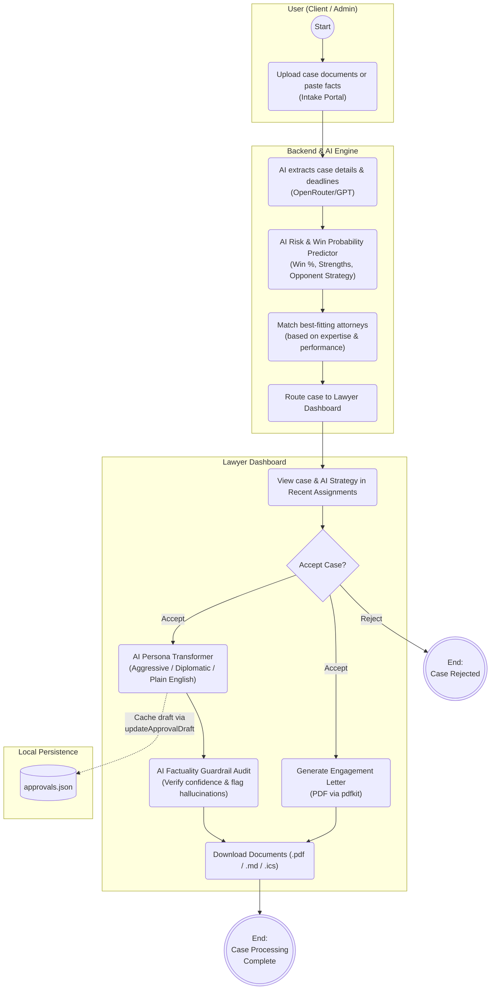

# Lawyer Tinder - AI Legal Matching & Management Platform

An AI-powered legal matching and case management application designed to streamline case routing, attorney-client matching, AI legal risk evaluation, multi-tone document generation, and factual audit guardrails.

> [!WARNING]
> **Production Readiness & Compliance Disclaimer**:
> All versions of this application are for demo purposes only and **NOT for production use**. 
> Before using it for any real-world purpose, you must establish a structured plan to address **data security**, **data governance**, and **GDPR** compliance (and any other applicable regulatory requirements).

---

## 🏛️ Project Overview

The **Lawyer Tinder** is a confidential law firm workflow platform with a modern dark-themed glassmorphism UI built for AI demonstrations and prototypes.

- **Frontend**: Built with React (Vite), React Router, Bootstrap, and custom CSS for a sleek, responsive user interface.
- **Backend**: Powered by Node.js and Express.
- **AI Engine**: Powered by OpenRouter (LLMs) for intelligent case extraction, risk prediction, multi-tone drafting, and factual guardrail audits, alongside `pdfkit` for PDF generation and ICS calendar exports.

---

## 🔄 Application Workflow



---

## ✨ Key Features

### 1. 📥 AI Intake Portal
- Upload case documents (PDF/Text) or paste raw case facts.
- **AI Information Extraction**: Automatically extracts relevant facts, key issues, deadlines, client info, and applicable governing legal codes (e.g. *BGB - Civil Code*, *StGB*).
- **Deterministic & AI Attorney Matching**: Ranks and matches the best-fitting attorneys based on practice area expertise and historic performance data.

### 2. 📊 Lawyer Dashboard & Analytics
- **Performance Analytics**: Visualizes lawyer stats, case volume, and success rates per practice area.
- **Recent Assignments**: Tabbed workflow allowing attorneys to view, accept, or reject incoming cases.

### 3. 🤖 AI Case Risk & Win Strategy Predictor
- **Win Probability Assessment**: Generates an estimated **Win Rate %** (10-95%) with a visual color-coded progress gauge.
- **Case Strengths & Vulnerabilities**: Highlights key factual advantages and potential legal risks.
- **Opponent Strategy Forecast**: AI predicts the opposing counsel's likely counter-arguments or defense strategy.

### 4. 🎭 AI Persona & Multi-Tone Draft Transformer
Generate or regenerate formal notice letters in 4 distinct AI tones:
- 📜 **Standard Notice**: Formal legal notice and position statement.
- ⚡ **Aggressive Demand**: Firm posture emphasizing legal penalties, statutory compliance deadlines, and immediate litigation intent.
- 🤝 **Diplomatic Settlement**: Cooperative tone emphasizing pre-litigation negotiation and mutual resolution.
- 🗣️ **Plain English Client Summary**: Jargon-free 5th-grade reading level explanation so clients clearly understand their case status.

### 5. 🔍 AI Factuality Verification Guardrail
- Audits AI-generated drafts against original source intake facts.
- Returns a **Verified Confidence Score (%)**, verification audit notes, and flags potential hallucinations or ungrounded claims (e.g., mismatched dates or fabricated names).

### 6. 📄 Automated Document & Calendar Generation
- **Engagement Letters (PDF)**: Instantly generates and downloads tailored PDF retainer agreements using `pdfkit`.
- **Calendar Deadline Export (.ics)**: One-click export of case deadlines into iCal / Outlook / Google Calendar `.ics` files.
- **Markdown Notice Downloads**: Download AI legal drafts as `.md` files.

### 7. 🔒 Security & Authentication
- **Protected Routes**: The application is secured behind a login screen (`admin` / `admin`).

---

## 🔌 API Endpoints Summary

| Method | Endpoint | Description |
| :--- | :--- | :--- |
| `POST` | `/api/extract` | Extract structured facts, legal code, and deadlines using AI |
| `POST` | `/api/upload` | Upload PDF/text file for AI fact extraction |
| `POST` | `/api/recommend` | Rank & match best-fitting lawyers for case details |
| `POST` | `/api/approve` | Approve lawyer assignment and persist approval |
| `GET` | `/api/cases` | Fetch all assigned cases |
| `GET` | `/api/lawyers` | Fetch all lawyer profiles and performance metrics |
| `POST` | `/api/cases/:id/risk-analysis` | Perform AI Win Probability & Strategy Analysis |
| `POST` | `/api/analyze-risk` | Standalone AI Risk & Strategy analysis |
| `POST` | `/api/cases/:id/draft` | Generate AI legal notice (supports `tone` parameter) |
| `POST` | `/api/cases/:id/verify-draft` | Audit AI draft factuality against source facts |
| `GET` | `/api/cases/:id/engagement-letter` | Download PDF engagement letter |
| `GET` | `/api/cases/:id/ics` | Download `.ics` calendar deadline file |

---

## 💾 Data Architecture & Persistence

Data is persisted locally via JSON data files:
- `backend/data/lawyers.json`: Attorney profiles, practice areas, and performance metrics.
- `backend/data/approvals.json`: Intake cases, approval statuses, risk analyses, and cached AI-generated draft documents.

---

## 📦 System Prerequisites & Installation

### Prerequisites
To run this application:
1. **Node.js**: Version `24.x` LTS recommended.
2. **npm**: Included automatically with Node.js.

---

## 🚀 Setup & Execution

### 💻 1. Development Environment

1. **Clone the Repository**:
   ```bash
   git clone <repository-url>
   cd "Lawyer Tinder"
   ```

2. **Install Dependencies**:
   ```bash
   npm install
   ```

3. **Configure Environment Variables**:
   Create a `.env` file inside the `backend` directory:
   ```env
   OPENROUTER_API_KEY=your_openrouter_api_key_here
   OPENROUTER_MODEL=openai/gpt-4o-mini
   ```

4. **Run Development Server**:
   Start both frontend and backend concurrently:
   ```bash
   npm run dev
   ```
   - **Frontend App**: `http://localhost:5173`
   - **Backend API**: `http://localhost:3001`
   - **Backend Health Check**: `http://localhost:3001/health`

> **Default credentials**: Username: `admin` | Password: `admin`

---

### 🏭 2. Production Environment

1. **Install Production Dependencies**:
   ```bash
   npm ci --omit=dev
   ```

2. **Build Static Production Bundle**:
   ```bash
   npm run build
   ```

3. **Run Production Server**:
   ```bash
   npm run start --workspace backend
   ```

---

## 🧪 Verification & Testing

- **Backend Unit Tests**: `npm test`
- **Frontend Production Build Check**: `npm run build --workspace frontend`
