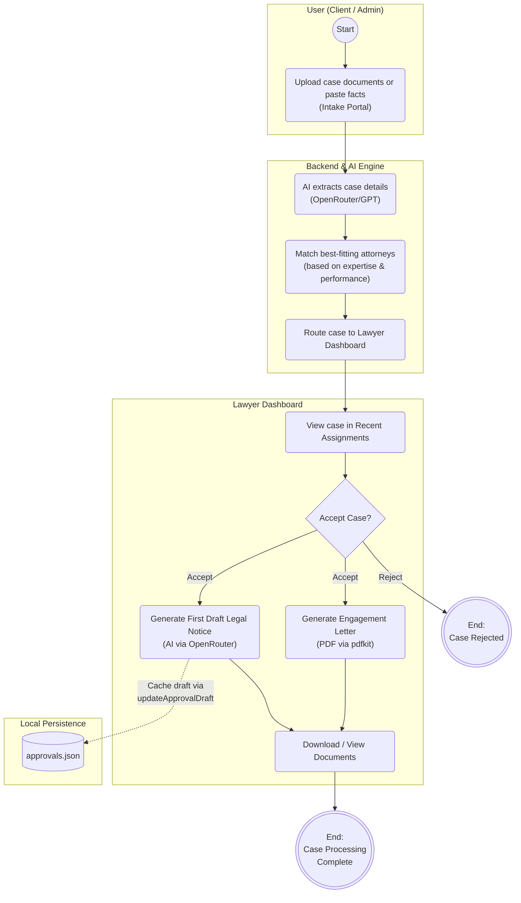

# Lawyer Tinder - AI Legal Matching & Management Platform

An AI-powered legal matching and case management application designed to streamline case routing, attorney-client matching, and legal document automation.

> [!WARNING]
> **Production Readiness & Compliance Disclaimer**:
> All versions of this application are for demo purposes only and **NOT for production use**. 
> Before using it for any real-world purpose, you must establish a structured plan to address **data security**, **data governance**, and **GDPR** compliance (and any other applicable regulatory requirements).

---

## 🏛️ Project Overview

The **Lawyer Tinder** is a confidential law firm workflow platform with a modern dark-themed glassmorphism UI.

- **Frontend**: Built with React (Vite), React Router, Bootstrap, and custom CSS for a sleek, responsive user interface.
- **Backend**: Powered by Node.js and Express.
- **AI & Automation**: Uses OpenRouter (GPT models) for intelligent case extraction and drafting legal notices, along with `pdfkit` for automated PDF document generation.

---

## 🔄 Application Workflow



---

## ✨ Key Features

### 1. 📥 Intake Portal
- Upload case documents or paste case facts.
- **AI Information Extraction**: Automatically extracts relevant facts, key issues, and practice areas.
- **Deterministic & AI Attorney Matching**: Ranks and matches the best-fitting attorneys based on expertise and performance data.

### 2. 📊 Lawyer Dashboard & Analytics
- **Performance Analytics**: Visualizes lawyer stats, case volume, and success rates per practice area.
- **Recent Assignments**: Tabbed workflow allowing attorneys to view, accept, or reject incoming cases.

### 3. 📄 Automated Document Generation
- **Engagement Letters (PDF)**: Instantly generates and downloads tailored PDF retainer agreements using `pdfkit`, auto-filling client facts and assigned lawyer details.
- **AI-Powered Legal Notice Drafting**: Generates formal first-draft legal notices (e.g., cease and desist) using OpenRouter AI. Drafts are displayed in a custom modal and can be downloaded as Markdown (`.md`).

### 4. 🌍 Full English Localization
- Cleanly localized legal terms, practice areas (e.g., *Employment Law*, *Civil Code*), and demo cases.

### 5. 🔒 Security & Authentication
- **Protected Routes**: The entire application, including the Intake Portal and Lawyer Dashboard, is secured behind a login screen.
- **Simple Login**: Employs a basic mock JWT authentication setup for quick testing and demonstration.

---

## 💾 Data Architecture & Persistence

Data is currently stored and persisted locally via JSON data files:
- `backend/data/lawyers.json`: Attorney profiles, practice areas, and performance metrics.
- `backend/data/approvals.json`: Intake cases, approval statuses, and cached AI-generated draft documents.

---

## 📦 System Prerequisites & Installation

### Prerequisites
To run this application, you must install:
1. **Node.js**: Version ``24.x` LTS recommended. Download from [nodejs.org](https://nodejs.org/).
2. **npm**: Included automatically with Node.js (`v11.x` or higher recommended).

---

## 🚀 Setup & Execution

### 💻 1. Development Environment

1. **Clone the Repository**:
   ```bash
   git clone <repository-url>
   cd "Lawyer Tinder"
   ```

2. **Install Dependencies**:
   ```bash
   npm install
   ```

3. **Configure Environment Variables**:
   Create a `.env` file inside the `backend` directory:
   ```env
   OPENROUTER_API_KEY=your_openrouter_api_key_here
   OPENROUTER_MODEL=your_preferred_ai_model_from_Openrouter_here
   ```

4. **Run Development Server**:
   Start both frontend and backend concurrently:
   ```bash
   npm run dev
   ```
   - **Frontend App**: `http://localhost:5173`
   - **Backend API**: `http://localhost:3001`
   - **Backend Health Check**: `http://localhost:3001/health`

> **Note**: Default credentials: **Username**: `admin` | **Password**: `admin`

---

### 🏭 2. Production Environment

Before deploying to a production server:

1. **Install Production Dependencies**:
   ```bash
   npm ci --omit=dev
   ```

2. **Build Static Production Bundle**:
   ```bash
   npm run build
   ```
   *(Creates optimized static frontend build in `frontend/dist`)*

3. **Set Environment Variables**:
   Ensure system environment or `backend/.env` contains production variables:
   ```env
   NODE_ENV=production
   PORT=3001
   OPENROUTER_API_KEY=your_production_openrouter_api_key
   ```

4. **Run Production Server**:
   - Serve `frontend/dist` via Nginx, Caddy, or an Express static file handler.
   - Start backend using Node or a process manager like `pm2`:
     ```bash
     npx pm2 start backend/server.js --name "lawyer-app-backend"
     ```
     Or directly via workspace script:
     ```bash
     npm run start --workspace backend
     ```

---

## 🧪 Verification & Testing

- **Backend Unit Tests**: `npm test`
- **Frontend Production Build Check**: `npm run build --workspace frontend`

